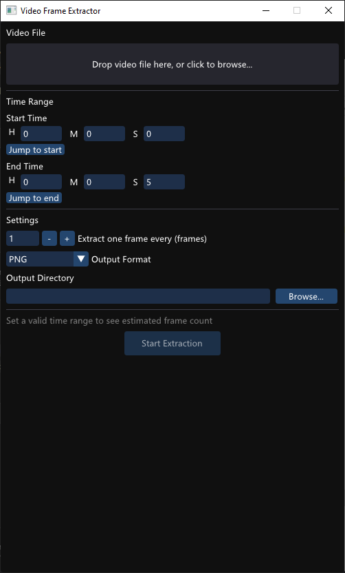

# Video Frame Extractor

A lightweight Windows desktop application for extracting frames from video files.



## Features

- **Drag & drop** a video file or pick one via file dialog
- Set a **time range** (start / end) to extract only the segment you care about
- Control extraction **interval** — grab every frame, every N frames, etc.
- Output as **PNG** (lossless) or **JPG** (high quality, small file size)
- Real-time **progress bar** with cancel support (press `ESC`)

## Tech Stack

| Layer | Library |
|-------|---------|
| Window & Input | GLFW 3.3 |
| GUI | Dear ImGui (OpenGL 3.3) |
| Video decoding | FFmpeg (libavcodec / libavformat / libswscale) |
| Image writing | stb_image_write (PNG), FFmpeg MJPEG encoder (JPG) |
| Build system | CMake + vcpkg (Visual Studio 2022, x64) |

## Building

**Prerequisites:**
- Visual Studio 2022 (with C++ desktop workload)
- [vcpkg](https://github.com/microsoft/vcpkg) (set `VCPKG_ROOT` environment variable)
- CMake 3.15+

```powershell
# Configure
cmake --preset vcpkg

# Build (Release)
cmake --build --preset release
```

The output binary will be in `build/Release/`.

## Usage

1. Launch the app
2. Drag a video file onto the window, or click **Open File**
3. Select an output folder
4. Adjust the time range and frame interval
5. Choose output format (PNG / JPG)
6. Click **Start Extraction**

Press `ESC` at any time to cancel.

---

# 视频抽帧

一个轻量级的 Windows 桌面应用，用于从视频文件中抽取帧画面。


## 功能

- **拖拽**视频文件到窗口，或通过文件对话框选择
- 设置**时间范围**（起始/结束），只提取你关心的片段
- 控制抽取**间隔** — 每帧、每隔 N 帧
- 输出为 **PNG**（无损）或 **JPG**（高质量、小体积）
- 实时**进度条**，支持按 `ESC` 取消

## 技术栈

| 层级 | 使用的库 |
|------|----------|
| 窗口与输入 | GLFW 3.3 |
| 界面 | Dear ImGui (OpenGL 3.3) |
| 视频解码 | FFmpeg (libavcodec / libavformat / libswscale) |
| 图片写入 | stb_image_write (PNG), FFmpeg MJPEG 编码器 (JPG) |
| 构建系统 | CMake + vcpkg (Visual Studio 2022, x64) |

## 构建

**前置条件：**
- Visual Studio 2022（含 C++ 桌面开发工作负载）
- [vcpkg](https://github.com/microsoft/vcpkg)（设置 `VCPKG_ROOT` 环境变量）
- CMake 3.15+

```powershell
# 配置
cmake --preset vcpkg

# 构建（Release）
cmake --build --preset release
```

输出的可执行文件位于 `build/Release/`。

## 使用

1. 启动程序
2. 将视频文件拖入窗口，或点击 **Open File** 选择文件
3. 选择输出目录
4. 调整时间范围和帧间隔
5. 选择输出格式（PNG / JPG）
6. 点击 **Start Extraction** 开始抽取

随时可按 `ESC` 取消。
